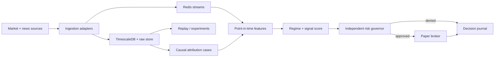

# Architecture

## Design principle

ScalpForge optimizes expected value after spread, slippage, fees, adverse selection, and drawdown—not the number of trades. Abstention is a valid and often preferred decision.

## Runtime boundaries

1. **Ingestion** adapters normalize broker ticks/candles and news/calendar payloads. Raw payload references and both event-time and receive-time are retained.
2. **Storage** keeps immutable market facts, event facts, movement case files, experiment provenance, and decision records. TimescaleDB supports time-series queries; object storage is the future home for raw and columnar datasets.
3. **Research/replay** advances a virtual clock and exposes only information available at that instant. The same feature implementation is used online to prevent training/serving skew.
4. **Intelligence** computes point-in-time features, detects regimes, scores directional candidates, and builds causal hypotheses. Attribution is probabilistic and may be `unknown`; correlation must not be presented as proven causation.
5. **Risk governor** is independent of strategy scoring and fails closed. It owns exposure, loss, drawdown, freshness, spread, sizing, stop validity, and kill-switch policy.
6. **Execution** receives only approved intents. Paper is the default. The MT4 port is isolated so a future Windows-side Expert Advisor/bridge can exchange idempotent commands and acknowledgements without embedding strategy logic.
7. **Observability/journal** records latency, gaps, drift, rejects, fills, P&L decomposition, configuration/model/data versions, and the evidence behind every decision.
8. **Strategy portfolio lab** runs transparent strategy families as isolated virtual traders. It
   journals approved, rejected, and abstained opportunities and forbids capital or outcome leakage
   between strategies. A later ensemble may allocate only from frozen out-of-sample evidence.
9. **Exit-policy experiments** identify every target/stop/trailing/time-exit variant explicitly.
   Dollar targets are normalized to basis points and `R` before comparison so balance and lot size
   cannot masquerade as strategy edge.

## Data correctness rules

- UTC everywhere; preserve source timestamps and ingestion timestamps.
- Every derived feature declares its lookback and availability time.
- Replays include spread, latency, slippage, rejected orders, and session/calendar effects.
- Dataset manifests are content-addressed; experiment rows bind code, config, data, and metrics.
- News licenses and redistribution constraints are connector-level requirements.

## Production evolution

The scaffold uses one API and one worker deployment while maintaining package boundaries. Split services only when scaling, fault isolation, or ownership requires it. First additions should be durable Redis Streams consumers, SQLAlchemy repositories/migrations, Parquet raw storage, OpenTelemetry export, Prometheus alerts, and a deterministic replay runner.

## Threat and failure posture

Secrets remain outside images and source control. Connectors use least-privilege credentials. Duplicate events are idempotent. Clock drift, missing sequence numbers, stale prices, disconnected bridges, malformed news, model uncertainty, and journal failure all trigger abstention or execution shutdown.
